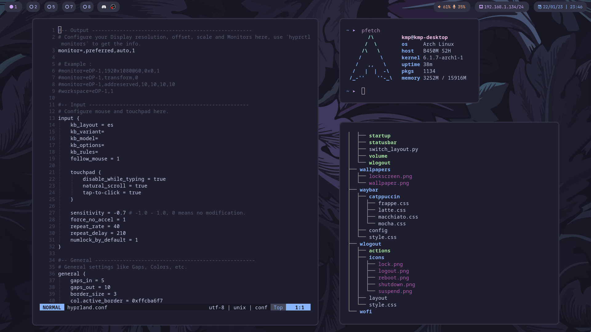

<h1 align="center"> 
    <samp>dotfiles</samp>
</h1>

    

<h2>
    <samp>Overview</samp>
</h2>

- **Operating System:** [Arch Linux](https://archlinux.org/)
- **Window Manager:** [Hyprland](https://hyprland.org/)
- **Terminal:** [kitty](https://sw.kovidgoyal.net/kitty/)
- **Shell:** [fish](https://fishshell.com/) with [starship](https://starship.rs/)
- **Editor:** [neovim](https://neovim.io/)
- **Panel:** [waybar](https://github.com/Alexays/Waybar)
- **Color scheme:** [catppuccin](https://github.com/catppuccin/catppuccin)
- **Application Launcher:** [wofi](https://github.com/kohnish/wofi)
- **Fetch:** [pfetch](https://github.com/dylanaraps/pfetch)

<h2>
    <samp>Credits</samp>
</h2>

- Base configs were taken from: [Archcraft Hyprland](https://github.com/archcraft-os/archcraft-hyprland) 